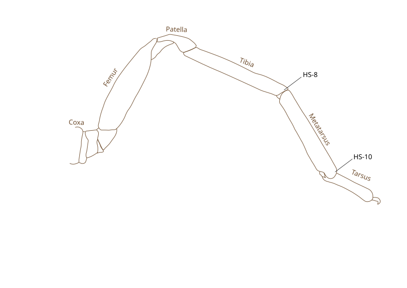
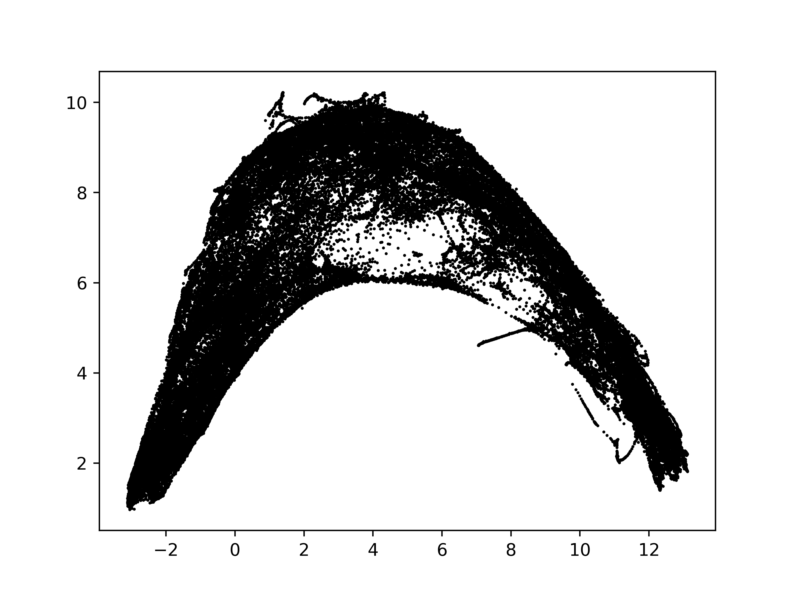
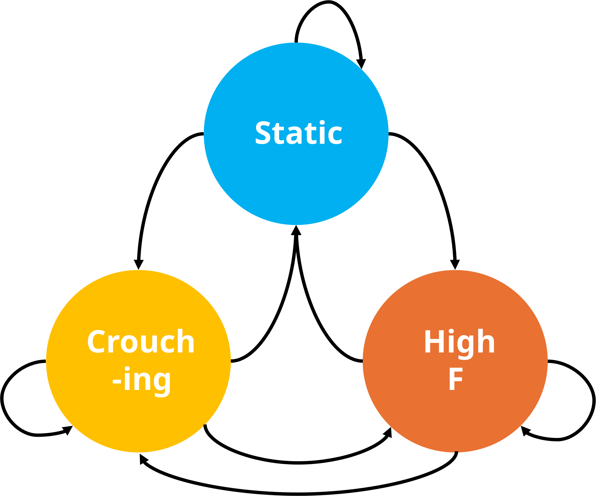
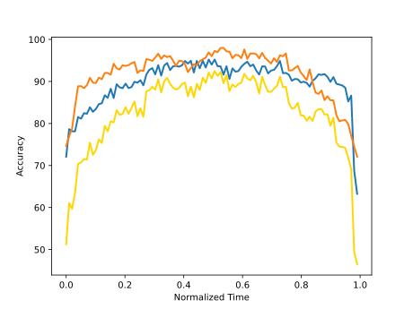

# Web vibration analysis pipeline

## Fourier transform of web vibration
1. Run `main.py` to perform web vibration analysis:
    * Fast Fourier Transform (FFT) analysis:  `FFT_web_vibration.py`
	    * The Fast Fourier Transform (FFT) of a time series of length \( N \) is defined as:
		    
		    $$ \text{FFT}[k] = \sum_{n=0}^{N-1} x[n] \cdot e^{-2\pi j kn / N} $$
		    
		    , where \(x[n]\) is the discrete-time signal and \(k\) is the frequency bin index. To investigate whole-web vibration, we computed the mean FFT across all silk lines.
	
     *  Short Time Fourier Transform (STFT) analysis:  `STFT_web_vibration.py`
    
		* The Short-Time Fourier Transform (STFT) is defined as:
       
			$$ \text{STFT}[m, k] = \sum_{n=0}^{N-1} x[n + mR] \cdot \omega[n] \cdot e^{-2\pi j kn / N} $$
			
			,where:
			- \( x [n] \) is the input signal,
			- \( \omega[n] \) is the window function of length \( N=400 (0.4s)\),
			- \( R =20 (0.02s)\) is the hop size,
			- \( m \) is the time frame index,
			- \( k \) is the frequency bin index.
3. Run `plot_FFT_heatmap_ratio.py` to plot Fourier Transform heat map:
	Ratio of frequency power between the experimental and control groups

## Regions of interest (ROIs) analysis of prey vibration on webs

#### Top camera
1. `Partialweb_vibration_analysis.py` : ROI analysis of top camera recordings to extract pure fly signal
    * Two selection windows will open: one for the spider and one for the prey. After selecting the ROIs, the program will automatically track both objects throughout the entire video. To modify the ROIs later, press "f" to reselect the prey (fly) or "s" to reselect the spider.
    * After selecting ROIs, `FFT_partial_web` and `STFT_partial_web` will be called to calculate FFT and STFT of pixel intensity fluctuation within the ROIs. For STFT, we used window = 400 (0.4s) and time step = 20 (0.02s).

2. `plot_roi_movie.py`: visualizing spider and fly peripheral STFT spectrum
3. `plot_roi_normalized_movie.py`: visualizing normalized fly STFT spectrum (fly center normalized by fly peripheral)
4. `plot_roi_normalized_fly_states.py`: plot normalized fly STFT figures for all top videos

#### Side camera
1. `Partialweb_vibration_analysis_side.py` : ROI analysis of side camera recordings to extract pure fly signal
    * Two selection windows will open: one for the spider and one for the prey. After selecting the ROIs, the program will automatically track both objects throughout the entire video. To modify the ROIs later, press "f" to reselect the prey (fly) or "s" to reselect the spider.
    * After selecting ROIs, `FFT_partial_web` and `STFT_partial_web` will be called to calculate FFT and STFT of pixel intensity fluctuation within the ROIs. For STFT, we used window = 40 (0.4s) and time step = 2 (0.02s).

2. `plot_roi_movie_side.py`: visualizing spider and fly peripheral STFT spectrum

#### Other scripts
1. `Partialweb_vibration_analysis_side_auto.py` : This script will automatically pop out a window for fly selection if it fails to track fly in the algorithm
2.  `Partialweb_vibration_analysis_side_piezo.py` : This script is for piezo experiment
3.  `Partialweb_vibration_analysis_side_piezo_auto.py` : This script will automatically pop out a window for piezo selection if it fails to track piezo in the algorithm

## Localization analysis

#### Localization based on pixel fluctuation signal
1. `localization_signalmap_visualization.py` : 
	* It extracts pixel fluctuation signal within spider's peripheral field and save it as `_signal_map_data.npz`
	* It pops out a window for you the select the radii you are interested in. 
	* In the second window, it plots mean pixel signal along the selected radii as a function of time.
2. `localization_results.py`: plot the linear regression results for all the videos
#### Localization based on STFT area under the curve (AUC)
1. `localization_AUC.py` : 
	* It calls `localized_spatial_AUC_web_vibration` to calculate area under STFT power between freq_m1=0 and freq_m2 = 50 for each pixel in spider's peripheral field.
	* We use  freq_m1=0 and freq_m2 = 50 because fly's signal is usually less than 50 Hz.
	* For STFT, we use window size = 40, with time step = 20 Since fly's signal is usually less than 50 Hz, we sacrifice frequency resolution and keep good temporal resolution for localization analysis. 
2. `localization_AUC_visualization.py` : This script is to visualize how AUC signal change over time in all radii
	* It pops out a window for you the select the radii you are interested in. 
	* In the second window, it plots mean AUC signal along the selected radii as a function of time.

# Spider Prey capture Behavior Repository

### [DeepLabCut](./deeplabcut_beh_analysis/README.md)
* Run DeepLabCut to track spider's joints from side videos recordings.
* Totally tracked 20 joints in each videos:
	* spider’s anterior and posterior legs: body-coxa, coxa-femur, femur-tibia, and tibia-metatarsus joints, as well as the tip of the tarsus.
	 
##### Analyze new videos
1. Analyzing new video: Run `deeplabcut_analyze new video.ipynb`
2. Extract outlier frame + Retrain network + create new videos: Run `deeplabcut_script.ipynb`

### [Wavelet analysis](./2_wavelet_hmm/wavelet_analysis/README.md)

* Apply the Morlet wavelet function to our side camera videos to study spider's prey capture movements.
1. Run **`wavelet_analysis/run_sidecamera_analysis.py`**: Run the `STFT_sidecamera.py` and `wavelet_sidecamera.py` for the joints data.
	1. **wavelet_analysis/wavelet_sidecamera.py**: Applies a [[#Morlet Wavelet transform]]to the limb tracking datasets from the side camera. 
		* There are totally 20 joints tracked by DeepLabCut.
		* Videos were recorded at 100 Hz.
		* X (vertical axis) is mean-centered; Y(horizontal axis) is centered for centroid)

	2. **wavelet_analysis/STFT_sidecamera.py**: Applies a STFT transform to the limb tracking datasets from the side camera. 
2. Run `wavelet_analysis/cut_wavelet.py` to trim the beginning of the videos to exclude the time before the flies are introduced onto the web. And also cutting spider's wrapping behavior. 

### Unsupervised identification of spider behavioral motifs - HMM
1. Data restructure:
	1. Only use 5 joints in left anterior legs for UMAP embeddings 
		* Other legs show very similar wavelet pattern. It is redundant
	2. Only use frequency between 2.38-50 Hz
		* Half of wavelet spectrum
	3. Only use vertical coordinates (X)
		1. Y is redundant
	4. In short,  joint wavelets —dimensions 5 joints $\times$ 25 frequencies  $\times$ 1 coordinate $\times$  30 recordings.
		1. 10 videos with manual labels.

2. UMAP embeddings:
	1. n_neighbors=100,min_dist=0,n_components=5
	
		 
3. K mean clustering
	1. Use **K-means** to cluster the data into 3 groups → this gives **pseudo-labels** for the states.
4. HMM
	1. Initialize Emission probability with K mean cluster labels
	2. Randomly initialize transition probability 
	3.  Run **Baum-Welch (EM)** to refine the model parameters.
	4. HMM parameters
		* algorithm = 'baum-welch'
		* min_iteration = 50
		* max_iteration = 500
		* stop_threshold = 1e-5
	

### Result summary 

1. HMM predict spider's behaviors with 83% accuracy.  (Based on 10 labeled videos)
	

